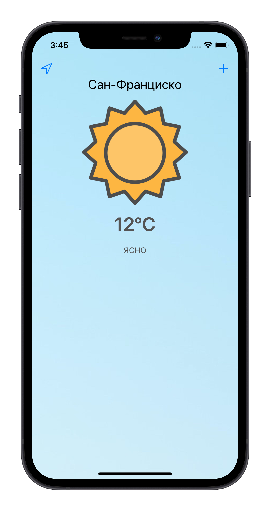
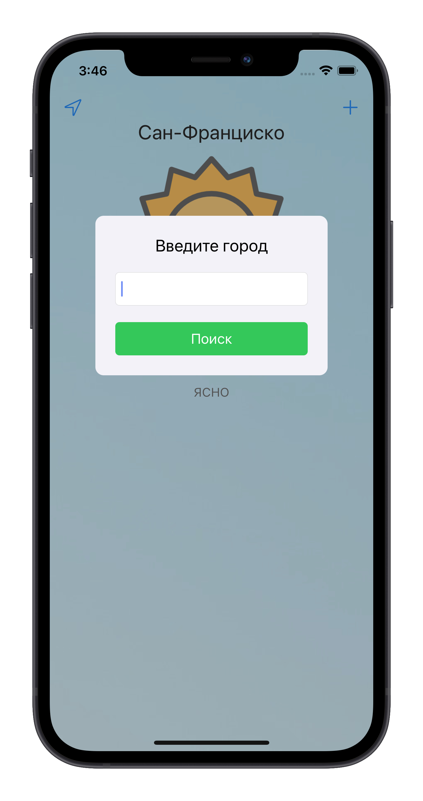
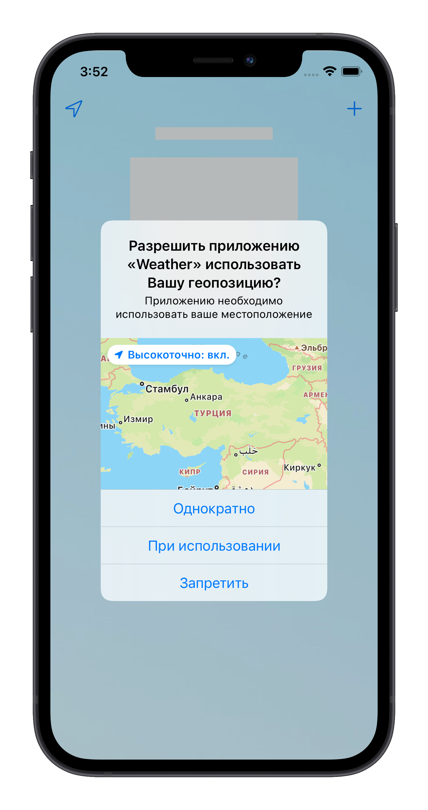
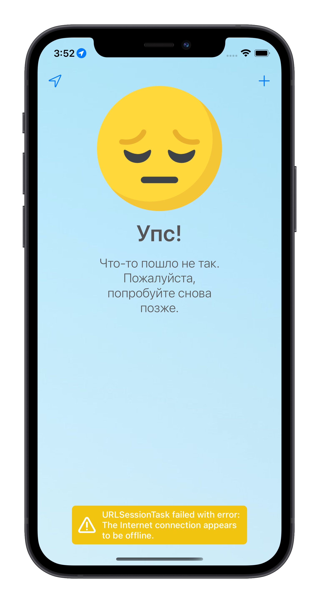

# Weather
Weather - это приложение показывающее текущую погоду, разработанное на Swift 5.
## Версии
V1.0 - поддержка iOS 14+ с использованием CocoaPods, Alamofire, SkeletonView, Loaf.
## Скриншоты
 
 
## Стек 
- Swift
- UIKit
- MVC
- Storyboards
- CocoaPods
- Alamofire
- SkeletonView
- Loaf
- UserDefaults
- CoreLocation
## Как установить
1. Клонировать репозиторий 

`$ git clone https://github.com/Prostoroff/Weather.git`

2. Установить библиотеки

`$ cd Weather/`

`$ pod install`

3. Открыть проект в Xcode

`$ open "Weather.xcworkspace`
